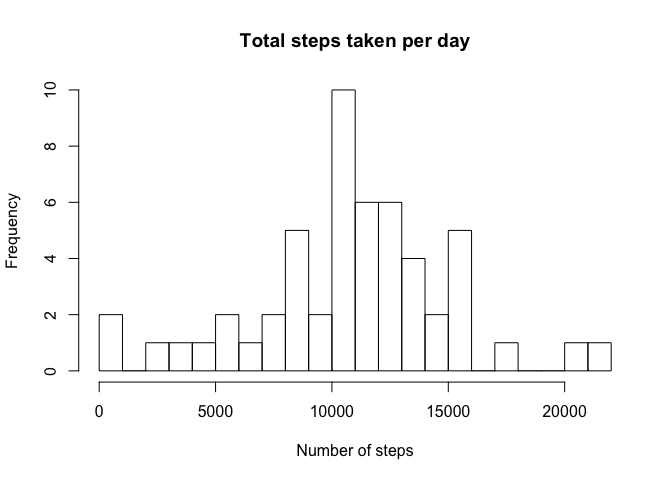
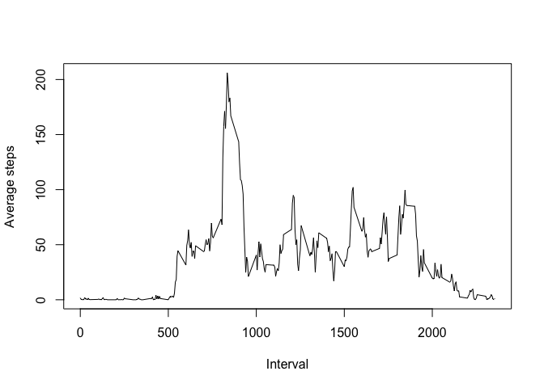
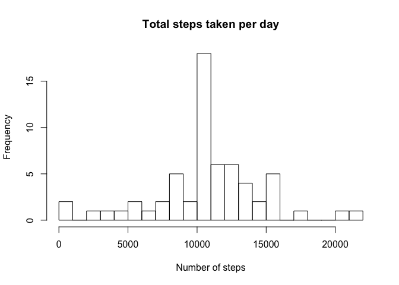

# Reproducible Research: Peer Assessment 1


## Loading and preprocessing the data

```r
##Load the data
data<-read.csv("activity.csv")
##Date transformation
data$date <- as.Date(data$date)
```

## What is mean total number of steps taken per day?
Calculate the total number of steps taken per day

```r
dailysteps<-aggregate(steps~date,data,sum)
dailysteps
```

```
##          date steps
## 1  2012-10-02   126
## 2  2012-10-03 11352
## 3  2012-10-04 12116
## 4  2012-10-05 13294
## 5  2012-10-06 15420
## 6  2012-10-07 11015
## 7  2012-10-09 12811
## 8  2012-10-10  9900
## 9  2012-10-11 10304
## 10 2012-10-12 17382
## 11 2012-10-13 12426
## 12 2012-10-14 15098
## 13 2012-10-15 10139
## 14 2012-10-16 15084
## 15 2012-10-17 13452
## 16 2012-10-18 10056
## 17 2012-10-19 11829
## 18 2012-10-20 10395
## 19 2012-10-21  8821
## 20 2012-10-22 13460
## 21 2012-10-23  8918
## 22 2012-10-24  8355
## 23 2012-10-25  2492
## 24 2012-10-26  6778
## 25 2012-10-27 10119
## 26 2012-10-28 11458
## 27 2012-10-29  5018
## 28 2012-10-30  9819
## 29 2012-10-31 15414
## 30 2012-11-02 10600
## 31 2012-11-03 10571
## 32 2012-11-05 10439
## 33 2012-11-06  8334
## 34 2012-11-07 12883
## 35 2012-11-08  3219
## 36 2012-11-11 12608
## 37 2012-11-12 10765
## 38 2012-11-13  7336
## 39 2012-11-15    41
## 40 2012-11-16  5441
## 41 2012-11-17 14339
## 42 2012-11-18 15110
## 43 2012-11-19  8841
## 44 2012-11-20  4472
## 45 2012-11-21 12787
## 46 2012-11-22 20427
## 47 2012-11-23 21194
## 48 2012-11-24 14478
## 49 2012-11-25 11834
## 50 2012-11-26 11162
## 51 2012-11-27 13646
## 52 2012-11-28 10183
## 53 2012-11-29  7047
```

```r
#Show a histogram of the total number of steps taken each day
hist(dailysteps$steps, breaks=20, main="Total steps taken per day", xlab="Number of steps")
```

 

```r
meansteps<-mean(dailysteps$steps)
meansteps<-format(meansteps, scientific=FALSE) ##Display this nicely rather than as an exponent
medsteps<-median(dailysteps$steps)
```

"Calculate and report the mean and median of the total number of steps taken per day"  
Answer:  
Mean number of steps taken per day (excluding NA values): 10766.19  
Median number of steps taken per day (excluding NA values): 10765

## What is the average daily activity pattern?

Make a time series plot (i.e. 𝚝𝚢𝚙𝚎 = "𝚕") of the 5-minute interval (x-axis) and the average number of steps taken, averaged across all days (y-axis)


```r
stepsPerInterval<-aggregate(steps~interval, data, mean)
maxsteps<-max(stepsPerInterval$steps)
interval <- stepsPerInterval$interval[stepsPerInterval$steps == maxsteps] 

plot(stepsPerInterval$interval, stepsPerInterval$steps, xlab="Interval", ylab="Average steps", type="l")
```

 

"Which 5-minute interval, on average across all the days in the dataset, contains the maximum number of steps?"  

Answer: 835

## Imputing missing values

Calculate and report the total number of missing values in the dataset (i.e. the total number of rows with 𝙽𝙰s)

```r
missingvals<-sum(is.na(data$steps))
```
Number of NA values: 2304


For the missing values, use the mean calculated earlier for that particular 5-minute interval.
Creating a new dataset that is equal to the original dataset but with the missing data filled in...

```r
completeData <- data ## Copy data

##Run through data and replace any NAs by average for that interval - use modulus operator to determine interval needed
intervalCount<-dim(stepsPerInterval) ## Number of intervals per day
for(i in seq_along(completeData$steps))
  {
    if (is.na(completeData$steps[i]))
      {
        index<-(i %% intervalCount[1])
        if (index==0)
          index<-intervalCount[1] ##No zero indexing in R
          
        completeData$steps[i]<-stepsPerInterval$steps[index]
      }
  }
```

Make a histogram of the total number of steps taken each day


```r
completedailysteps<-aggregate(steps~date,completeData,sum)
completedailysteps
```

```
##          date    steps
## 1  2012-10-01 10766.19
## 2  2012-10-02   126.00
## 3  2012-10-03 11352.00
## 4  2012-10-04 12116.00
## 5  2012-10-05 13294.00
## 6  2012-10-06 15420.00
## 7  2012-10-07 11015.00
## 8  2012-10-08 10766.19
## 9  2012-10-09 12811.00
## 10 2012-10-10  9900.00
## 11 2012-10-11 10304.00
## 12 2012-10-12 17382.00
## 13 2012-10-13 12426.00
## 14 2012-10-14 15098.00
## 15 2012-10-15 10139.00
## 16 2012-10-16 15084.00
## 17 2012-10-17 13452.00
## 18 2012-10-18 10056.00
## 19 2012-10-19 11829.00
## 20 2012-10-20 10395.00
## 21 2012-10-21  8821.00
## 22 2012-10-22 13460.00
## 23 2012-10-23  8918.00
## 24 2012-10-24  8355.00
## 25 2012-10-25  2492.00
## 26 2012-10-26  6778.00
## 27 2012-10-27 10119.00
## 28 2012-10-28 11458.00
## 29 2012-10-29  5018.00
## 30 2012-10-30  9819.00
## 31 2012-10-31 15414.00
## 32 2012-11-01 10766.19
## 33 2012-11-02 10600.00
## 34 2012-11-03 10571.00
## 35 2012-11-04 10766.19
## 36 2012-11-05 10439.00
## 37 2012-11-06  8334.00
## 38 2012-11-07 12883.00
## 39 2012-11-08  3219.00
## 40 2012-11-09 10766.19
## 41 2012-11-10 10766.19
## 42 2012-11-11 12608.00
## 43 2012-11-12 10765.00
## 44 2012-11-13  7336.00
## 45 2012-11-14 10766.19
## 46 2012-11-15    41.00
## 47 2012-11-16  5441.00
## 48 2012-11-17 14339.00
## 49 2012-11-18 15110.00
## 50 2012-11-19  8841.00
## 51 2012-11-20  4472.00
## 52 2012-11-21 12787.00
## 53 2012-11-22 20427.00
## 54 2012-11-23 21194.00
## 55 2012-11-24 14478.00
## 56 2012-11-25 11834.00
## 57 2012-11-26 11162.00
## 58 2012-11-27 13646.00
## 59 2012-11-28 10183.00
## 60 2012-11-29  7047.00
## 61 2012-11-30 10766.19
```

```r
hist(completedailysteps$steps, breaks=20, main="Total steps taken per day", xlab="Number of steps")
```

 

Calculate and report the mean and median total number of steps taken per day. 

```r
completemean<-mean(completedailysteps$steps)

completemed<-median(completedailysteps$steps)
```

Answer:  
Mean number of steps taken per day (imputing NA values): 1.0766189\times 10^{4}  
Median number of steps taken per day (imputing NA values): 1.0766189\times 10^{4}

Do these values differ from the estimates from the first part of the assignment? 

Answer: Not significantly


What is the impact of imputing missing data on the estimates of the total daily number of steps?
Answer: Step count is averaged for those with all data missing, otherwise not changed significantly

## Are there differences in activity patterns between weekdays and weekends?
I've run out of time to complete this - sorry. 
Thanks for reading!
